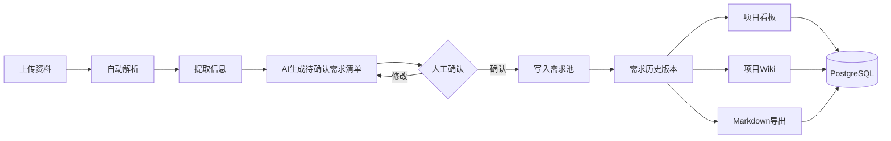

# 木铎知会

## 目录
- [项目简介](#项目简介)
- [核心功能](#核心功能)
- [技术栈](#技术栈)
- [快速开始](#快速开始)
- [环境变量配置](#环境变量配置)
- [数据库模型](#数据库模型)
- [商业化部署底座](#商业化部署底座)
- [验证](#验证)
- [参与贡献](#参与贡献)
- [开源协议](#开源协议)

## 项目简介

  一款结合“组织沟通”与”知识沉淀”的平台,核心功能是把会议录音、文档、截图和业务资料等信息源自动编译成项目内 LLM Wiki，并自动生成待确认的需求、决策以及伴随的风险。根据后续项目进程也会不断生成待确认的需求变更。


## 核心功能



- **资料上传**：支持文本、Markdown、PDF、Word、Excel、图片、音频等多种格式文件上传。
- **自动解析与更新**：上传资料后，系统自动分析内容，更新项目 Wiki 页面版本，并生成变更点、决策记录、风险提示、待确认事项。
- **AI 辅助变更**：AI 只负责生成“待确认的变更项”；只有你手动确认后，这些变更才会正式写入当前需求池和需求历史版本。
- **项目 Wiki 管理**：提供 Wiki 页面列表、详情查看、每个页面的来源资料数量、以及完整的版本记录。
- **一键导出为 Markdown**：可一键生成 Obsidian 可直接打开的 `index.md`、`log.md`、`changes.md`、`sources.md` 文件，以及每个 Wiki 页面的独立 Markdown 文件。
- **项目看板**：所有看板数据（指标、趋势、状态、最近变更、来源资料）都来自后端，实时更新。
- **生产级数据库模型**：使用 Prisma + PostgreSQL 定义并管理完整的数据结构，适合生产环境部署。

## 技术栈

（请填写：前端、后端、数据库、AI 模型/API、部署方式等）

## 快速开始

```bash
npm install
npm run dev
```

- **前端**：http://localhost:5173

- **API**：http://localhost:4000/api/health

如需完整的 OpenAI 编译能力，请复制 .env.example 为 .env，填写 OPENAI_API_KEY。

补充：未配置 Key 时，系统会使用本地启发式编译器跑通完整流程。


### 前提条件

（请填写：需要安装 Docker / Node.js / 数据库等）

### 使用 Docker 部署

（请填写：docker-compose 命令、访问地址）

### 本地开发运行

（请填写：git clone、安装依赖、配置 env、运行命令等）

## 环境变量配置

（请填写：`DATABASE_URL`、`OPENAI_API_KEY` 等示例）

## 数据库模型

（请填写：Prisma 主要模型说明，如 Conversation、Requirement 的字段）

## 使用指南

（请填写：上传沟通记录 → 点击生成 → 输出待确认需求清单 → 人工编辑导出 的步骤，可配图说明）

## AI 提示词策略

（请填写：提示词设计思路、输出 JSON Schema 示例、如何处理冲突和模糊点）

## 项目文件结构

（请填写：关键目录与文件的作用，如 `server/`、`src/`、`prisma/` 等）

## 参与贡献

（请填写：如何提 Issue、Fork、PR 流程，贡献方向）

## 开源协议

（请填写：MIT / Apache 2.0 等）

## 联系方式与社区

（请填写：GitHub Issues 链接、微信群 / Discord、作者信息等）
