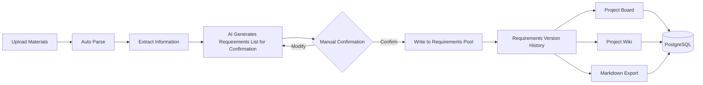

## Languages
- [中文](README.zh-CN.md)
- [English](README.md)

# Notice from the Wooden Bell

## catalogue
- [Project Overview](#project-overview)
- [Core function](#Core-function)
- [Core Strengths](#Core-Strengths)
- [Application scenarios](#Application-scenarios)
- [Technical stack](#Technical-stack)
- [Quick Start](#Quick-start)
- [Environment Variable Configuration](#Environment-Variable-Configuration)
- [Database Model](#Database-model)
- [Commercial Deployment Base](#Commercial-deployment-base)
- [Verification](#Verification)
- [Contributing](#Contributing)
- [Open Source License](#Open-source-license)


## Project-Overview

This platform is an AI knowledge collaboration and requirements management platform for project teams, which can automatically parse multi-source data such as meeting recordings, documents, screenshots, tables, pictures, and audios into project wiKs, and intelligently generate requirements, decisions, risks and change tips. All AI-generated content requires manual confirmation before entering the formal demand pool, which not only improves the efficiency of project management, but also ensures that key decisions are controllable and traceable.

The platform is suitable for scenarios such as software development, digital projects, product requirements management, enterprise knowledge base, consulting and delivery, bidding scheme preparation, R&D knowledge precipitation and cross-department collaboration, helping organizations to transform daily communication and project data into reusable, traceable and deliverable knowledge assets


## Core-function



- **Upload Materials**: Supports uploading files in various formats such as text, Markdown, PDF, Word, Excel, images, and audio.

- **Automatic Parsing and Update**: After uploading materials, the system automatically analyzes the content, updates the project Wiki page version, and generates change points, decision records, risk alerts, and items pending confirmation.

- **AI-Assisted Changes**: AI only generates "change items pending confirmation"; these changes are formally written into the current requirements pool and requirements history only after you manually confirm them.

- **Project Wiki Management**: Provides a list of Wiki pages, detailed views, the number of source materials for each page, and complete version records.

- **One-Click Export to Markdown**: Generates Obsidian-compatible files such as `index.md`, `log.md`, `changes.md`, `sources.md` with a single click, along with individual Markdown files for each Wiki page.

- **Project Board**: All board data (metrics, trends, status, recent changes, source materials) comes from the backend and is updated in real time.

- **Production-Grade Database Model**: Uses Prisma + PostgreSQL to define and manage a complete data structure, suitable for production deployment.


## Core-Strengths

### Unified management of multi-source data
The platform supports the upload of text, Markdown, PDF, Word, Excel, pictures, screenshots, audio, conference recordings and other data, which can gather project information scattered in different channels to form a complete project database.

### Automatically generate project wikis
The system can automatically parse and upload the data, and generate the project-specific Wiki page, the project background, business requirements, function description, decision records, risk tips and other content structured precipitation, improve the efficiency of knowledge management.

### Extract key information intelligently
The platform can automatically identify requirements, decisions, risks, change points and items to be confirmed from meetings, documents and business data, reducing manual sorting costs and reducing the risk of information omission.

### Controllable management of requirements change
AI only generates requirements and changes to be confirmed, and all content must be manually confirmed before it is officially written into the requirements pool and history version to ensure that the project change process is safe and controllable.

### The whole process can be traced
The platform keeps a complete record of sources, Wiki versions, requirements changes, decision making processes, and risk alerts, making every update in the project documented for easy review and accountability tracking.

### The project kanban board is updated in real time
The project Kanban board data are all from the real data of the backend, which can display the project status, demand changes, risk situation, recent updates and source information in real time, and help managers quickly grasp the project progress.

### Support the continuous precipitation of knowledge
With the continuous uploading of project information, the system will continuously update the Wiki pages and version records, so that project knowledge can be continuously accumulated and improved with the advancement of business.

### Easy to archive and reuse
The platform supports one-click export of Obsidian Markdown files that can be opened directly, which facilitates local archiving, secondary editing, knowledge reuse and achievement delivery of teams.

### Suitable for enterprise deployment
The system uses Prisma + PostgreSQL to build a production-level database model, which can support long-term management of core data such as projects, materials, requirements, changes, risks, decisions and versions.

### Improve organizational collaboration efficiency
The platform transforms meeting communication, business documents and project data into manageable, traceable and reusable knowledge assets, which helps teams reduce repeated communication, improve collaboration efficiency and project delivery quality.


## Application-scenarios

### Software Development Project Management
This solution is applicable to software development, system integration, platform construction, and other projects. It can automatically organize various materials such as requirement documents, meeting recordings, prototype screenshots, and technical plans into a project Wiki, helping the team to uniformly manage requirements, changes, decisions, and risks. 

### Product Requirements Management
This solution is suitable for product managers to manage the requirements pool, plan versions, and organize user feedback. The platform can automatically identify new requirements, changes in requirements, and items awaiting confirmation, thereby reducing the cost of manual organization and improving the efficiency of requirements management. 

### Enterprise Knowledge Base Construction
This solution is suitable for the accumulation of internal knowledge within enterprises. It integrates and manages system documents, training materials, business processes, meeting minutes, and project documents, creating a sustainable and updatable enterprise knowledge base that is traceable. 

### Meeting Minutes and Decision Tracking
Applicable to project meetings, requirement review meetings, customer communication meetings, and management meetings. The platform can automatically extract key decisions, risk warnings, and subsequent tasks from meeting recordings and meeting materials. 

### Digital Transformation Project
Suitable for enterprise digital platform construction, business system upgrades and process optimization projects, this helps teams document business requirements, technical solutions, implementation processes and change records, ensuring the smooth progress of the projects. 

### Consultation and Delivery Projects
Suitable for management consulting, industry research, solution planning and customer delivery projects. The platform can consolidate interview records, research materials, solution documents and meeting contents into a project Wiki, facilitating project archiving and reusing of results. 

### Bidding and Proposal Preparation
Applicable to bidding documents, project application forms, project initiation reports and construction proposal preparation. The platform can uniformly organize policy documents, customer demands, budget tables and historical data, thereby improving the efficiency of proposal writing. 

### Research and development knowledge accumulation
This technology solution is applicable to the management of technical plans, interface documents, test reports, screenshot records of issues, and version change records for the R&D team. It helps the team build a complete technical knowledge asset, facilitating subsequent maintenance and personnel handover. 

### Cross-departmental collaborative management
This approach is applicable to projects involving business, product, technology, operation and management teams. The platform reduces information transmission errors through a unified project Wiki and dashboard, and enhances cross-departmental communication efficiency. 

### Project Review and Result Archiving
This is applicable for the data organization, process review and result archiving after the project is completed. The platform can fully retain the source of the data, changes in requirements, decision-making records and risk processes, providing reference for subsequent projects.


## Technical-stack

- **Frontend Framework**：React 19
 
- **Build Tool**：Vite 7
 
- **Visualization Charts**：d3.js + Recharts
 
- **Icon Library**：lucide-react
 
- **Backend Framework**：Express 5
 
- **Database ORM**：Prisma 7（supports PostgreSQL）
 
- **Database Driver**：postgres（direct connection）
 
- **File Parsing**：

  - PDF：`pdf-parse`
  - Word：`mammoth`
  - Excel：`exceljs`
  - Markdown：`markdown-it`

- **Flowchart Rendering**：Mermaid 11

- **AI Integration**：OpenAI SDK 6

- **Task Queue**：BullMQ + Redis（ioredis）

- **Object Storage**：Alibaba Cloud OSS（`ali-oss`）

- **File Upload**：multer

- **Utility Libraries**：dotenv、cors、concurrently


## Quick-start

```bash
npm install
npm run dev
```

- **Frontend**：http://localhost:5173

- **API**：http://localhost:4000/api/health

For complete OpenAI compilation capability, please copy .env.example to .env and fill in OPENAI_API_KEY。

Note：When no key is configured, the system will use the local heuristic compiler to run through the entire process.


## Environment-Variable-Configuration

### Development Environment

Copy .env.example to .env and configure at least

```bash
OPENAI_API_KEY=your key
```

### Production environment

```bash
NODE_ENV=production
SESSION_SECRET=足够长的随机字符串
DATABASE_URL=postgresql://...
REDIS_URL=redis://...
JOB_QUEUE_PROVIDER=bullmq
STORAGE_PROVIDER=oss
ALI_OSS_REGION=oss-cn-hangzhou
ALI_OSS_BUCKET=你的私有 Bucket
ALI_OSS_ACCESS_KEY_ID=...
ALI_OSS_ACCESS_KEY_SECRET=...
```

OSS Bucket should be set to private read and write. Front-end preview and download through back-end authentication after generating a short-term signature URL.


## Database-model

Prisma schema is defined in prisma/schema.prisma and supports PostgreSQL production.

For local development use the JSON schema: npm run migrate:json


## Commercial-deployment-base

The current code remains in native JSON development mode, but has added production boundaries:

- **Database**：PostgreSQL schema → `prisma/schema.prisma`
- **Develop alternatives locally**：JSON migration script → `npm run migrate:json`
- **Object storage**：Ali Cloud OSS abstraction → `STORAGE_PROVIDER=oss`
- **Asynchronous queue**：BullMQ + Redis → `JOB_QUEUE_PROVIDER=bullmq`
- **Process splitting**：API is separated from Worker → `npm start` and `npm run start:worker`
- **Container orchestration**：Docker Compose integration → PostgreSQL、Redis、API、Worker


## Verification

```bash
npm run build
npm run prisma:validate
npm run dev:server
npm run smoke
```


## Contributing

Xi'an Chaoye Yangchuang Information Technology Co., Ltd.


## Open-source-license

Apache 2.0 
