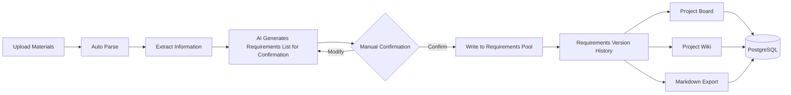

## Languages
- [中文](README.zh-CN.md)
- [English](README.md)

# Notice from the Wooden Bell

## catalogue
- [Project Overview](#project-overview)
- [Core function](#Core-function)
- [Core Strengths](#Core-Strengths)
- [Application scenarios](#Application-scenarios)
- [Technical stack](#Technical-stack)
- [Quick Start](#Quick-start)
- [Environment Variable Configuration](#Environment-Variable-Configuration)
- [Database Model](#Database-model)
- [Commercial Deployment Base](#Commercial-deployment-base)
- [Verification](#Verification)
- [Contributing](#Contributing)
- [Open Source License](#Open-source-license)


## Project-Overview

This platform is an AI knowledge collaboration and requirements management platform for project teams, which can automatically parse multi-source data such as meeting recordings, documents, screenshots, tables, pictures, and audios into project wiKs, and intelligently generate requirements, decisions, risks and change tips. All AI-generated content requires manual confirmation before entering the formal demand pool, which not only improves the efficiency of project management, but also ensures that key decisions are controllable and traceable.

The platform is suitable for scenarios such as software development, digital projects, product requirements management, enterprise knowledge base, consulting and delivery, bidding scheme preparation, R&D knowledge precipitation and cross-department collaboration, helping organizations to transform daily communication and project data into reusable, traceable and deliverable knowledge assets


## Core-function



- **Upload Materials**: Supports uploading files in various formats such as text, Markdown, PDF, Word, Excel, images, and audio.

- **Automatic Parsing and Update**: After uploading materials, the system automatically analyzes the content, updates the project Wiki page version, and generates change points, decision records, risk alerts, and items pending confirmation.

- **AI-Assisted Changes**: AI only generates "change items pending confirmation"; these changes are formally written into the current requirements pool and requirements history only after you manually confirm them.

- **Project Wiki Management**: Provides a list of Wiki pages, detailed views, the number of source materials for each page, and complete version records.

- **One-Click Export to Markdown**: Generates Obsidian-compatible files such as `index.md`, `log.md`, `changes.md`, `sources.md` with a single click, along with individual Markdown files for each Wiki page.

- **Project Board**: All board data (metrics, trends, status, recent changes, source materials) comes from the backend and is updated in real time.

- **Production-Grade Database Model**: Uses Prisma + PostgreSQL to define and manage a complete data structure, suitable for production deployment.


## Core-Strengths


## Application-scenarios
## Technical-stack

- **Frontend Framework**：React 19
 
- **Build Tool**：Vite 7
 
- **Visualization Charts**：d3.js + Recharts
 
- **Icon Library**：lucide-react
 
- **Backend Framework**：Express 5
 
- **Database ORM**：Prisma 7（supports PostgreSQL）
 
- **Database Driver**：postgres（direct connection）
 
- **File Parsing**：

  - PDF：`pdf-parse`
  - Word：`mammoth`
  - Excel：`exceljs`
  - Markdown：`markdown-it`

- **Flowchart Rendering**：Mermaid 11

- **AI Integration**：OpenAI SDK 6

- **Task Queue**：BullMQ + Redis（ioredis）

- **Object Storage**：Alibaba Cloud OSS（`ali-oss`）

- **File Upload**：multer

- **Utility Libraries**：dotenv、cors、concurrently


## Quick-start

```bash
npm install
npm run dev
```

- **Frontend**：http://localhost:5173

- **API**：http://localhost:4000/api/health

For complete OpenAI compilation capability, please copy .env.example to .env and fill in OPENAI_API_KEY。

Note：When no key is configured, the system will use the local heuristic compiler to run through the entire process.


## Environment-Variable-Configuration

### Development Environment

Copy .env.example to .env and configure at least

```bash
OPENAI_API_KEY=your key
```

### Production environment

```bash
NODE_ENV=production
SESSION_SECRET=足够长的随机字符串
DATABASE_URL=postgresql://...
REDIS_URL=redis://...
JOB_QUEUE_PROVIDER=bullmq
STORAGE_PROVIDER=oss
ALI_OSS_REGION=oss-cn-hangzhou
ALI_OSS_BUCKET=你的私有 Bucket
ALI_OSS_ACCESS_KEY_ID=...
ALI_OSS_ACCESS_KEY_SECRET=...
```

OSS Bucket should be set to private read and write. Front-end preview and download through back-end authentication after generating a short-term signature URL.


## Database-model

Prisma schema is defined in prisma/schema.prisma and supports PostgreSQL production.

For local development use the JSON schema: npm run migrate:json


## Commercial-deployment-base

The current code remains in native JSON development mode, but has added production boundaries:

- **Database**：PostgreSQL schema → `prisma/schema.prisma`
- **Develop alternatives locally**：JSON migration script → `npm run migrate:json`
- **Object storage**：Ali Cloud OSS abstraction → `STORAGE_PROVIDER=oss`
- **Asynchronous queue**：BullMQ + Redis → `JOB_QUEUE_PROVIDER=bullmq`
- **Process splitting**：API is separated from Worker → `npm start` and `npm run start:worker`
- **Container orchestration**：Docker Compose integration → PostgreSQL、Redis、API、Worker


## Verification

```bash
npm run build
npm run prisma:validate
npm run dev:server
npm run smoke
```


## Contributing

Xi'an Chaoye Yangchuang Information Technology Co., Ltd.


## Open-source-license

Apache 2.0 
