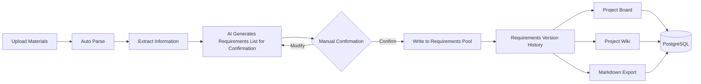

# Notice from the Wooden Bell

## catalogue
- [Project Overview](#project-overview)
- [Core function](#Core-function)
- [Technical stack](#Technical-stack)
- [Quick Start](#quick-start)
- [Environment Variable Configuration](#environment-variable-configuration)
- [Database Model](#database-model)
- [Commercial Deployment Base](#commercial-deployment-base)
- [Verification](#verification)
- [Contributing](#contributing)
- [Open Source License](#open-source-license)


## Project-Overview

 A platform that integrates "organizational communication" and "knowledge accumulation", its core function is to automatically compile information sources such as meeting recordings, documents, screenshots, and business materials into an LLM Wiki within the project, and automatically generate requirements, decisions, and accompanying risks that need confirmation. Based on the subsequent project progress, requirements changes that need confirmation will also be continuously generated.


## Core-function



- **Upload Materials**: Supports uploading files in various formats such as text, Markdown, PDF, Word, Excel, images, and audio.

- **Automatic Parsing and Update**: After uploading materials, the system automatically analyzes the content, updates the project Wiki page version, and generates change points, decision records, risk alerts, and items pending confirmation.

- **AI-Assisted Changes**: AI only generates "change items pending confirmation"; these changes are formally written into the current requirements pool and requirements history only after you manually confirm them.

- **Project Wiki Management**: Provides a list of Wiki pages, detailed views, the number of source materials for each page, and complete version records.

- **One-Click Export to Markdown**: Generates Obsidian-compatible files such as `index.md`, `log.md`, `changes.md`, `sources.md` with a single click, along with individual Markdown files for each Wiki page.

- **Project Board**: All board data (metrics, trends, status, recent changes, source materials) comes from the backend and is updated in real time.

- **Production-Grade Database Model**: Uses Prisma + PostgreSQL to define and manage a complete data structure, suitable for production deployment.


## Technical-stack

- **Frontend Framework**：React 19
 
- **Build Tool**：Vite 7
 
- **Visualization Charts**：d3.js + Recharts
 
- **Icon Library**：lucide-react
 
- **Backend Framework**：Express 5
 
- **Database ORM**：Prisma 7（supports PostgreSQL）
 
- **Database Driver**：postgres（direct connection）
 
- **File Parsing**：

  - PDF：`pdf-parse`
  - Word：`mammoth`
  - Excel：`exceljs`
  - Markdown：`markdown-it`

- **流程图渲染**：Mermaid 11
 
- **AI 集成**：OpenAI SDK 6
 
- **任务队列**：BullMQ + Redis（ioredis）
 
- **对象存储**：阿里云 OSS（`ali-oss`）
 
- **文件上传**：multer
 
- **工具库**：dotenv、cors、concurrently


## 快速开始

```bash
npm install
npm run dev
```

- **前端**：http://localhost:5173

- **API**：http://localhost:4000/api/health

如需完整的 OpenAI 编译能力，请复制 .env.example 为 .env，填写 OPENAI_API_KEY。

补充：未配置 Key 时，系统会使用本地启发式编译器跑通完整流程。


## 环境变量设置

### 开发环境

复制 .env.example 为 .env，至少配置

```bash
OPENAI_API_KEY=your key
```

### 生产环境

```bash
NODE_ENV=production
SESSION_SECRET=足够长的随机字符串
DATABASE_URL=postgresql://...
REDIS_URL=redis://...
JOB_QUEUE_PROVIDER=bullmq
STORAGE_PROVIDER=oss
ALI_OSS_REGION=oss-cn-hangzhou
ALI_OSS_BUCKET=你的私有 Bucket
ALI_OSS_ACCESS_KEY_ID=...
ALI_OSS_ACCESS_KEY_SECRET=...
```

OSS Bucket 应设置为私有读写；前端预览和下载通过后端鉴权后生成短期签名 URL。


## 数据库模型

Prisma schema 定义在 prisma/schema.prisma，支持 PostgreSQL 生产环境。

本地开发可使用 JSON 模式：npm run migrate:json


## 商业化部署底座

当前代码保留本地 JSON 开发模式，同时已加入生产化边界：

- **数据库**：PostgreSQL schema → `prisma/schema.prisma`
- **本地开发备选**：JSON 迁移脚本 → `npm run migrate:json`
- **对象存储**：阿里云 OSS 抽象 → `STORAGE_PROVIDER=oss`
- **异步队列**：BullMQ + Redis → `JOB_QUEUE_PROVIDER=bullmq`
- **进程拆分**：API 与 Worker 分离 → `npm start` 与 `npm run start:worker`
- **容器编排**：Docker Compose 集成 → PostgreSQL、Redis、API、Worker


## 设计公司

Xi'an Chaoye Yangchuang Information Technology Co., Ltd.


## 开源协议

Apache 2.0 


## 验证

```bash
npm run build
npm run prisma:validate
npm run dev:server
npm run smoke
```
