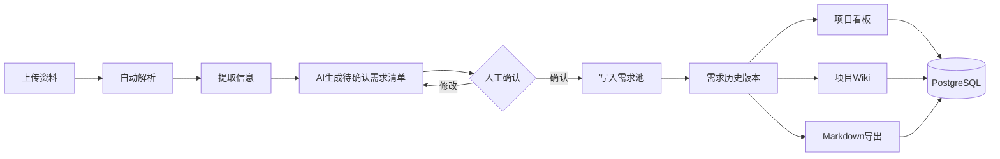

## 语言
- [中文](README.zh-CN.md)
- [English](README.md)

# 木铎知会

## 目录
- [项目简介](#项目简介)
- [核心功能](#核心功能)
- [核心优势](#核心优势)
- [应用场景](#应用场景)
- [技术栈](#技术栈)
- [快速开始](#快速开始)
- [环境变量配置](#环境变量配置)
- [数据库模型](#数据库模型)
- [商业化部署底座](#商业化部署底座)
- [验证](#验证)
- [主体公司](#主体公司)
- [开源协议](#开源协议)


## 项目简介

   本平台是一款面向项目团队的 AI 知识协同与需求管理平台，可将会议录音、文档、截图、表格、图片、音频等多源资料自动解析为项目 Wiki，并智能生成需求、决策、风险和变更提示。所有 AI 生成内容均需人工确认后才会进入正式需求池，既提升项目管理效率，又确保关键决策可控、可追溯。

平台适用于软件开发、数字化项目、产品需求管理、企业知识库、咨询交付、招投标方案编制、研发知识沉淀和跨部门协作等场景，帮助组织把日常沟通和项目资料转化为可复用、可追踪、可交付的知识资产
   


## 核心功能



- **资料上传**：支持文本、Markdown、PDF、Word、Excel、图片、音频等多种格式文件上传。

- **自动解析与更新**：上传资料后，系统自动分析内容，更新项目 Wiki 页面版本，并生成变更点、决策记录、风险提示、待确认事项。

- **AI 辅助变更**：AI 只负责生成“待确认的变更项”；只有你手动确认后，这些变更才会正式写入当前需求池和需求历史版本。

- **项目 Wiki 管理**：提供 Wiki 页面列表、详情查看、每个页面的来源资料数量、以及完整的版本记录。

- **一键导出为 Markdown**：可一键生成 Obsidian 可直接打开的 `index.md`、`log.md`、`changes.md`、`sources.md` 文件，以及每个 Wiki 页面的独立 Markdown 文件。

- **项目看板**：所有看板数据（指标、趋势、状态、最近变更、来源资料）都来自后端，实时更新。

- **生产级数据库模型**：使用 Prisma + PostgreSQL 定义并管理完整的数据结构，适合生产环境部署。


## 核心优势

###多源资料统一管理
平台支持文本、Markdown、PDF、Word、Excel、图片、截图、音频、会议录音等多种资料上传，能够将分散在不同渠道的项目信息统一汇聚，形成完整的项目资料库。

###自动生成项目 Wiki
系统可自动解析上传资料，并生成项目专属 Wiki 页面，将项目背景、业务需求、功能说明、决策记录、风险提示等内容结构化沉淀，提升知识管理效率。

###智能提取关键信息
平台能够从会议、文档和业务资料中自动识别需求、决策、风险、变更点和待确认事项，减少人工整理成本，降低信息遗漏风险。

###需求变更可控管理
AI 仅生成待确认的需求和变更项，所有内容必须经过人工确认后，才会正式写入需求池和历史版本，确保项目变更过程安全可控。

###全过程可追溯
平台完整记录资料来源、Wiki 版本、需求变更、决策过程和风险提示，使项目中的每一次更新都有据可查，便于复盘和责任追踪。

###项目看板实时更新
项目看板数据全部来自后端真实数据，可实时展示项目状态、需求变化、风险情况、最近更新和来源资料，帮助管理者快速掌握项目进展。

###支持知识持续沉淀
随着项目资料不断上传，系统会持续更新 Wiki 页面和版本记录，使项目知识能够伴随业务推进不断积累和完善。

###便于归档与复用
平台支持一键导出 Obsidian 可直接打开的 Markdown 文件，方便团队进行本地归档、二次编辑、知识复用和成果交付。

###适合企业级部署
系统采用 Prisma + PostgreSQL 构建生产级数据库模型，能够支撑项目、资料、需求、变更、风险、决策和版本等核心数据的长期管理。

###提升组织协同效率
平台将会议沟通、业务文档和项目资料转化为可管理、可追踪、可复用的知识资产，帮助团队减少重复沟通，提高协作效率和项目交付质量。


## 应用场景


## 技术栈

- **前端框架**：React 19
 
- **构建工具**：Vite 7
 
- **可视化图表**：d3.js + Recharts
 
- **图标库**：lucide-react
 
- **后端框架**：Express 5
 
- **数据库 ORM**：Prisma 7（支持 PostgreSQL）
 
- **数据库驱动**：postgres（直接连接）
 
- **文件解析**：

  - PDF：`pdf-parse`
  - Word：`mammoth`
  - Excel：`exceljs`
  - Markdown：`markdown-it`
- **流程图渲染**：Mermaid 11
 
- **AI 集成**：OpenAI SDK 6
 
- **任务队列**：BullMQ + Redis（ioredis）
 
- **对象存储**：阿里云 OSS（`ali-oss`）
 
- **文件上传**：multer
 
- **工具库**：dotenv、cors、concurrently


## 快速开始

```bash
npm install
npm run dev
```

- **前端**：http://localhost:5173

- **API**：http://localhost:4000/api/health

如需完整的 OpenAI 编译能力，请复制 .env.example 为 .env，填写 OPENAI_API_KEY。

补充：未配置 Key 时，系统会使用本地启发式编译器跑通完整流程。


## 环境变量配置

### 开发环境

复制 .env.example 为 .env，至少配置

```bash
OPENAI_API_KEY=your key
```

### 生产环境

```bash
NODE_ENV=production
SESSION_SECRET=足够长的随机字符串
DATABASE_URL=postgresql://...
REDIS_URL=redis://...
JOB_QUEUE_PROVIDER=bullmq
STORAGE_PROVIDER=oss
ALI_OSS_REGION=oss-cn-hangzhou
ALI_OSS_BUCKET=你的私有 Bucket
ALI_OSS_ACCESS_KEY_ID=...
ALI_OSS_ACCESS_KEY_SECRET=...
```

OSS Bucket 应设置为私有读写；前端预览和下载通过后端鉴权后生成短期签名 URL。


## 数据库模型

Prisma schema 定义在 prisma/schema.prisma，支持 PostgreSQL 生产环境。

本地开发可使用 JSON 模式：npm run migrate:json


## 商业化部署底座

当前代码保留本地 JSON 开发模式，同时已加入生产化边界：

- **数据库**：PostgreSQL schema → `prisma/schema.prisma`
- **本地开发备选**：JSON 迁移脚本 → `npm run migrate:json`
- **对象存储**：阿里云 OSS 抽象 → `STORAGE_PROVIDER=oss`
- **异步队列**：BullMQ + Redis → `JOB_QUEUE_PROVIDER=bullmq`
- **进程拆分**：API 与 Worker 分离 → `npm start` 与 `npm run start:worker`
- **容器编排**：Docker Compose 集成 → PostgreSQL、Redis、API、Worker


## 验证

```bash
npm run build
npm run prisma:validate
npm run dev:server
npm run smoke
```


## 主体公司

Xi'an Chaoye Yangchuang Information Technology Co., Ltd.


## 开源协议

Apache 2.0 
